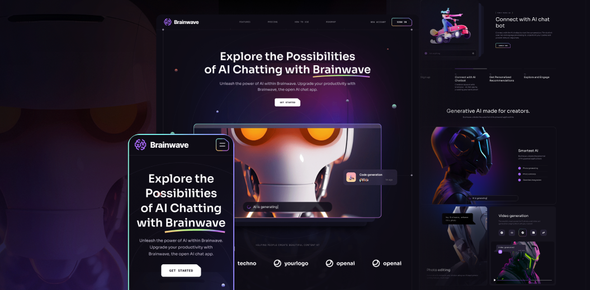

# Brainwave - AI Landing Page



A modern, responsive React landing page for Brainwave, an AI-powered chat application. Built with React, Vite, and Tailwind CSS, featuring stunning animations, parallax effects, and a beautiful dark-themed UI with purple and orange accents.

This project showcases a complete landing page design for an AI chatbot application, demonstrating modern web development practices, responsive design, and engaging user interfaces.

## 🔗 Live Demo

👉 [View Deployed App](https://Rola-Al-Ahmad.github.io/brainwave/)

---

## 🚀 Features

- **Modern Hero Section**: Eye-catching hero section with 3D robot illustration and animated elements

- **AI Chatbot Showcase**: Interactive demonstration of AI chat capabilities with real-time generation indicators

- **Feature Highlights**: Comprehensive display of key features including:

  - Ask anything - Quick answers to user queries

  - Improve everyday - Natural language processing capabilities

  - Connect everywhere - Cross-device accessibility

  - Fast responding - Quick response times

- **Services Section**: Detailed showcase of AI services:

  - Photo generating

  - Photo enhancement

  - Seamless integration with popular tools

- **Collaboration Tools**: Integration with popular platforms:

  - Figma, Notion, Discord, Slack

  - Photoshop, Protopie, Framer, Raindrop

- **Pricing Plans**: Clear pricing structure with Basic, Premium, and Enterprise tiers

- **Product Roadmap**: Visual roadmap showing upcoming features and development progress

- **Responsive Design**: Fully optimized for desktop, tablet, and mobile devices

- **Smooth Animations**: Parallax scrolling effects and smooth transitions

- **Modern UI/UX**: Dark theme with purple and orange gradient accents

## 🛠️ Tech Stack

- **Frontend Framework**: React 18.3.1

- **Build Tool**: Vite 5.4.8

- **Styling**: Tailwind CSS 3.4.13

- **Routing**: React Router DOM 6.26.2

- **Animations**: React Just Parallax 3.1.16

- **Utilities**: Scroll Lock 2.1.5

- **Code Quality**: ESLint with React-specific rules

- **CSS Processing**: PostCSS with Autoprefixer

## 📱 Screenshots

The application is designed to be responsive across all devices:

- **Desktop**: Full-featured layout with parallax effects and animations

- **Tablet**: Optimized layout for medium screens

- **Mobile**: Mobile-first responsive design with hamburger navigation

## 🚀 Getting Started

### Prerequisites

- Node.js (version 16 or higher)

- npm or yarn package manager

### Installation

1. **Clone the repository**

   ```bash
   git clone <repository-url>
   cd brainwave
   ```

2. **Install dependencies**

   ```bash
   npm install
   ```

3. **Start the development server**

   ```bash
   npm run dev
   ```

4. **Open your browser**

   Navigate to `http://localhost:5173` to view the application.

## 📁 Project Structure

```
src/
├── App.jsx                 # Main application component
├── main.jsx               # Application entry point
├── App.css                # Application styles
├── index.css              # Global styles and Tailwind imports
├── assets/                # Static assets (images, icons, SVGs)
│   ├── thumbnail.png     # Project thumbnail
│   └── svg/              # SVG components
├── components/            # React components
│   ├── Header.jsx         # Navigation header component
│   ├── Hero.jsx           # Hero section with 3D robot
│   ├── Benefits.jsx       # Features/benefits section
│   ├── Collaboration.jsx  # Collaboration tools section
│   ├── Services.jsx       # AI services showcase
│   ├── Pricing.jsx        # Pricing plans section
│   ├── Roadmap.jsx        # Product roadmap section
│   ├── Footer.jsx         # Footer component
│   ├── Button.jsx         # Reusable button component
│   ├── Heading.jsx        # Section heading component
│   ├── Section.jsx        # Section wrapper component
│   ├── Tagline.jsx        # Tagline component
│   ├── Generating.jsx     # AI generation indicator
│   ├── Notification.jsx   # Notification component
│   ├── CompanyLogos.jsx   # Company logos display
│   ├── PricingList.jsx    # Pricing list component
│   └── design/            # Design system components
│       ├── Header.jsx
│       ├── Hero.jsx
│       ├── Benefits.jsx
│       ├── Collaboration.jsx
│       ├── Services.jsx
│       ├── Pricing.jsx
│       └── Roadmap.jsx
└── constants/             # Application constants
    └── index.jsx          # Navigation, pricing, roadmap data
```

## 🔧 Available Scripts

- `npm run dev` - Start development server

- `npm run build` - Build for production

- `npm run preview` - Preview production build

- `npm run lint` - Run ESLint for code quality

## 🚀 Deployment

### GitHub Pages (Recommended)

This project can be easily deployed to GitHub Pages:

1. **Build the project**

   ```bash
   npm run build
   ```

2. **Deploy to GitHub Pages**

   - Push the `dist` folder to the `gh-pages` branch, or

   - Use GitHub Actions for automatic deployment

### Manual Build

To build the project for production:

```bash
npm run build
```

The built files will be in the `dist/` directory, ready for deployment to any static hosting service.

### Environment Setup

For GitHub Pages deployment, ensure:

- Your repository is public (or you have GitHub Pro for private repos)

- GitHub Pages is enabled in your repository settings

- Update the `base` path in `vite.config.js` if deploying to a subdirectory

## 🎨 Design System

The application follows a consistent design system with:

- **Color Scheme**: Dark theme with purple and orange gradient accents

- **Typography**: Modern, clean font hierarchy

- **Spacing**: Consistent spacing using Tailwind CSS utilities

- **Components**: Reusable component library with design system components

- **Animations**: Smooth parallax effects and transitions

- **Responsive Breakpoints**: Mobile-first approach with Tailwind breakpoints

## 🎯 Key Sections

### Hero Section

- Eye-catching headline with gradient text
- 3D robot illustration
- Interactive chat interface preview
- Call-to-action button
- Company logos showcase

### Benefits Section

- Feature cards with icons
- Animated backgrounds
- Responsive grid layout

### Collaboration Section

- Integration showcase
- Popular tool logos
- Feature highlights

### Services Section

- AI service capabilities
- Visual demonstrations
- Service descriptions

### Pricing Section

- Three-tier pricing structure
- Feature comparisons
- Clear call-to-action

### Roadmap Section

- Development timeline
- Feature status indicators
- Visual progress tracking

## 🤝 Contributing

1. Fork the repository

2. Create a feature branch (`git checkout -b feature/amazing-feature`)

3. Commit your changes (`git commit -m 'Add some amazing feature'`)

4. Push to the branch (`git push origin feature/amazing-feature`)

5. Open a Pull Request

## 📄 License

This project is licensed under the MIT License - see the LICENSE file for details.

## 🙏 Acknowledgments

- React and Vite communities for excellent tooling

- Tailwind CSS for the utility-first CSS framework

- React Just Parallax for smooth parallax effects

- All contributors and open-source libraries used in this project

## 📞 Support

If you encounter any issues or have questions, please:

1. Check the existing issues in the repository

2. Create a new issue with detailed information

3. Include steps to reproduce the problem

---

**Happy coding! 🚀**
